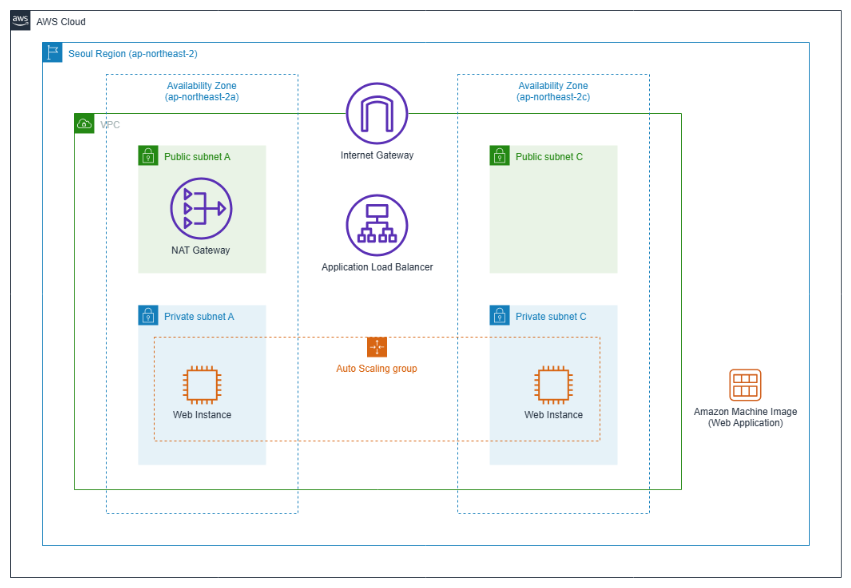
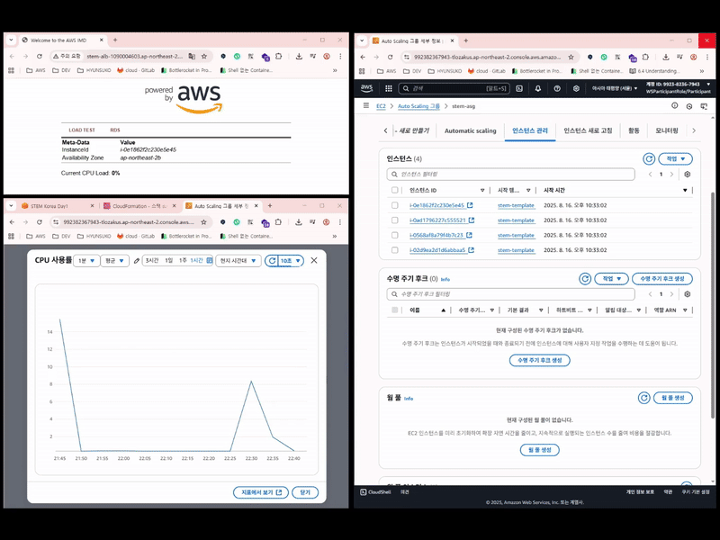

# LAMP Stack (ALB+ASG)

(5+ min deployment)

## Description
`LAMP = Linux + Apache + PHP + MySQL/MariaDB`

## Architecture

## Preview

## References
- [What is LAMP Stack](https://aws.amazon.com/ko/what-is/lamp-stack/)
- [AWS General Immersion Day Advanced Workshop](https://catalog.us-east-1.prod.workshops.aws/workshops/869a0a06-1f98-4e19-b5ac-cbb1abdfc041/ko-KR/advanced-modules/compute)