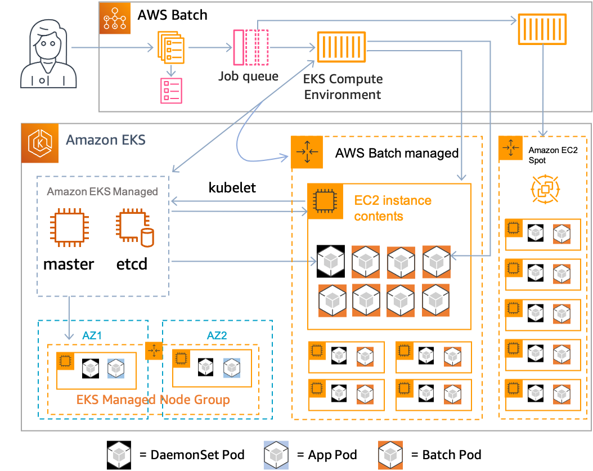

# AWS Batch on EKS

## Architecture

## References
- [Getting Started](https://docs.aws.amazon.com/ko_kr/batch/latest/userguide/getting-started-eks.html)
- [Batch Compute Environment - EKS](https://docs.aws.amazon.com/ko_kr/batch/latest/userguide/eks.html)