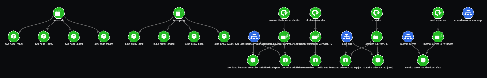
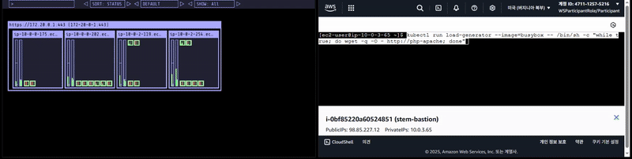

# EKS Cluster - Custom Managed Node Group (MNG)

## Architecture
[Kubernetes]



## Preview


## Notes

Custom Launch Template
- AMI (optional)
- InstanceType (optional)
- Subnet(s) (optional)
- SecurityGroup(s) (required)
- UserData (empty(Auto) or mime-multipart(AL2023) or ...)
- IamRole(InstanceProfile) (don't include)

Load Test
```
kubectl run load-generator --image=busybox -- /bin/sh -c "while true; do wget -q -O - http://php-apache; done"
```