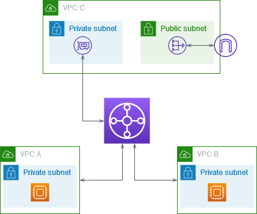

# Centralized Outbound Routing to the Internet

## Architecture

## Preview

## Notes

## References
- [How Transit Gateway Works](https://docs.aws.amazon.com/vpc/latest/tgw/how-transit-gateways-work.html#transit-gateway-nat-igw-overview)