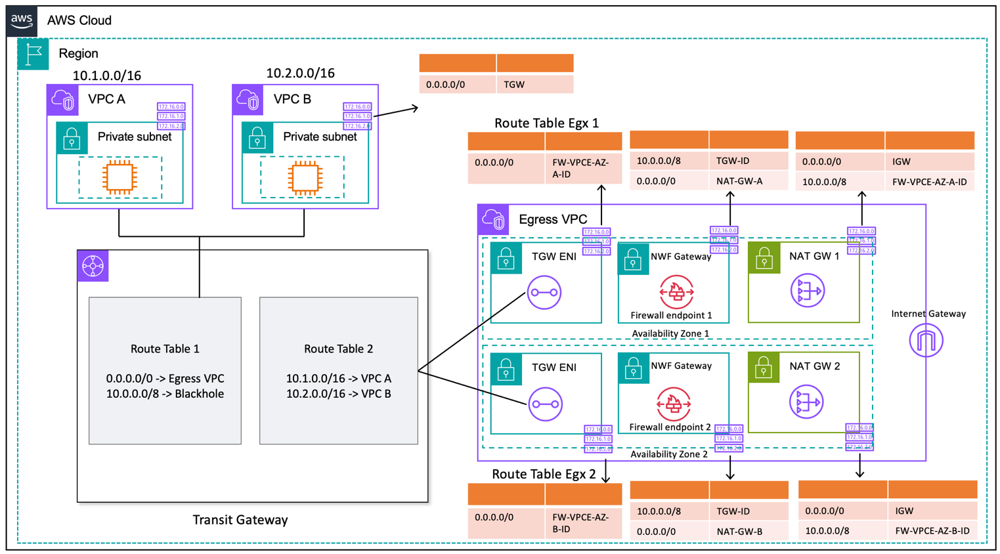

# Centralized Outbound Routing to the Internet

## Architecture

## Preview

## Notes

## References
- [Multi-VPC Network Architecture](https://docs.aws.amazon.com/ko_kr/whitepapers/latest/building-scalable-secure-multi-vpc-network-infrastructure/using-nat-gateway-with-firewall.html)