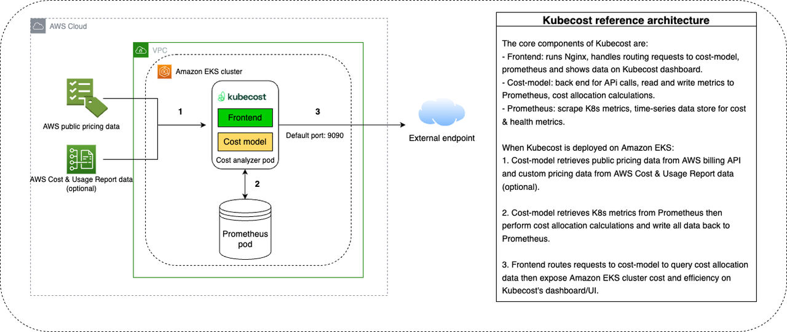

# EKS Kubecost

## Architecture

## References
- [AWS Docs](https://docs.aws.amazon.com/ko_kr/eks/latest/userguide/cost-monitoring-kubecost.html)
- [Kubecost AddOn](https://aws.amazon.com/ko/blogs/aws/new-aws-marketplace-for-containers-now-supports-direct-deployment-to-amazon-eks-clusters)
- [IBM Docs](https://www.ibm.com/docs/en/kubecost/self-hosted/2.x?topic=installations-amazon-eks-integration)