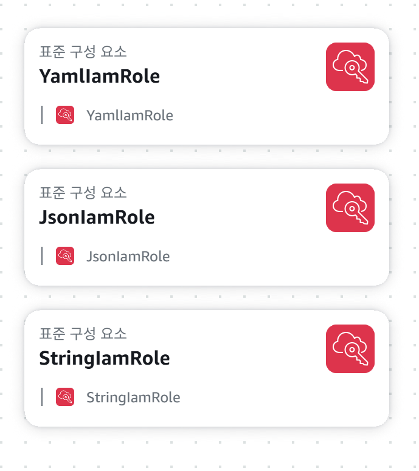

# IAM Role

## Architecture


## Notes

YAML / JSON / String

#### Trust Relationships
```
{
    "Version": "2012-10-17",
    "Statement": [
        {
            "Effect": "Allow",
            "Principal": {
                "Service": "ec2.amazonaws.com"
            },
            "Action": "sts:AssumeRole"
        }
    ]
}
```

#### Permissions
```
{
    "Version": "2012-10-17",
    "Statement": [
        {
            "Action": [
                "s3:*",
                "s3-object-lambda:*"
            ],
            "Resource": "*",
            "Effect": "Allow"
        }
    ]
}
```