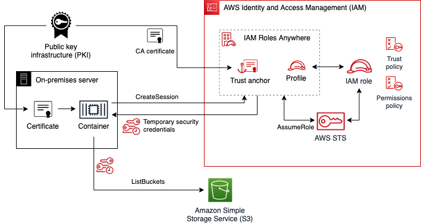
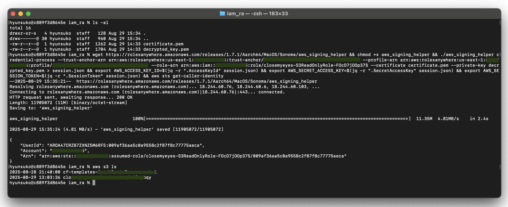

# IAM Roles Anywhere

## Overview
Trust Anchor로 Private CA 등록, "온프레미스 서버"는 CA에서 발행한 클라이언트 인증서로 AWS 서비스에 접속하기 위한 임시 보안자격 증명 획득

## Architecture

## Preivew

## References
- [re:Post Article](https://repost.aws/ko/articles/ARuzTUwUK_QpW2U0m0PvNAAw/iam-roles-anywhere%EB%A5%BC-%EC%82%AC%EC%9A%A9%ED%95%98%EC%97%AC-aws-%EC%99%B8%EB%B6%80%EC%97%90%EC%84%9C-%EC%8B%A4%ED%96%89%EB%90%98%EB%8A%94-%EC%95%A0%ED%94%8C%EB%A6%AC%EC%BC%80%EC%9D%B4%EC%85%98%EC%97%90%EC%84%9C-aws-%EB%A6%AC%EC%86%8C%EC%8A%A4-%EC%95%A1%EC%84%B8%EC%8A%A4-%ED%95%98%EB%8A%94-%EB%B0%A9%EC%95%88)
- [What is IAM Roles Anywhere](https://docs.aws.amazon.com/ko_kr/rolesanywhere/latest/userguide/introduction.html)